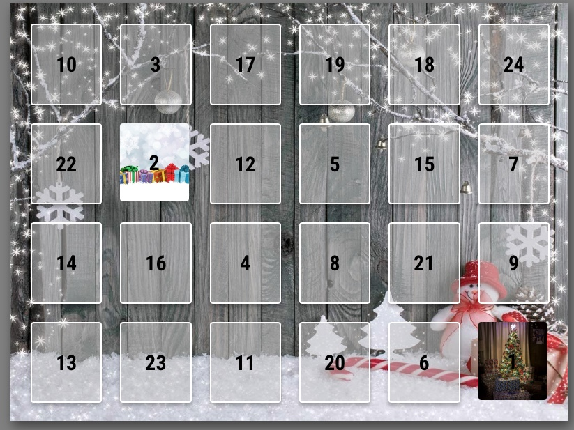

# MMM-Adventskalender
The MMM-Adventskalender module for MagicMirror is an interactive Advent calendar that displays a grid of doors (24 in total) which open on specific days in December. The module includes various configurable options and functionalities designed to enhance the user experience. 



[Module description]

## Installation

### Install

In your terminal, go to your [MagicMirror²][mm] Module folder and clone MMM-Adventskalender:

```bash
cd ~/MagicMirror/modules
git clone [GitHub url]
```

### Update

```bash
cd ~/MagicMirror/modules/MMM-Adventskalender
git pull
```

## Using the module

To use this module, add it to the modules array in the `config/config.js` file:

```js
{
    module: "MMM-Adventskalender",
    position: "top_center",
    config: {
        backgroundImage: "/modules/MMM-Adventskalender/images/background.jpg",
        doorMargin: 30,
        moduleWidth: 800,
        moduleHeight: 600,
        autopen: true,
        autoopenat: "10:00",
    },
},

```


## Configuration options

Option|Possible values|Default|Description
------|------|------|-----------
`backgroundImage`|`string`|not available|link to your background image to use
`doorMargin`|`integer`|margin around each door.
`moduleWidth`|`string`|not available|total height
`moduleHeight`|`string`|not available|total width
`autopen`|`boolean`|false|opens the door of the day automatic. Useful in headless mode.
`autopenat`|`string`|"00:00"|defines the time when the door should open.


## Pictures
- choose a background picture
- choose 24 other pictures for the door and name it 01....24
- I took the pictures as a proof of concept from [Pixabay]: https://pixabay.com

## Features:
### Fixed Grid Layout:
The calendar consists of 24 doors, arranged in a 6x4 grid (6 columns and 4 rows). The size and layout of the doors adjust dynamically based on the module's dimensions and spacing configurations.
### Background Image:
The background of the calendar is customizable, allowing the user to specify an image (e.g., a festive background) that will fill the entire module's area. This image maintains its aspect ratio and scales to fit the module size.
### Door Numbering and Images:
Each door is numbered from 1 to 24. The doors' numbers are randomized (the numbering order, not the positions) and saved in the state.json file to ensure consistency across restarts. When a door is opened, a corresponding image (e.g., numbered images such as 01.jpg, 02.jpg) is displayed behind the door. Each door has an image that is hidden until opened.
### Opening Doors:
Doors can be opened by clicking on them. When clicked, the door "opens," revealing an image behind it. Once opened, the door remains open across all sessions (persistent state) and will be saved in state.json.
### Automatic Opening (Auto Open):
With the autopen option enabled, doors corresponding to dates earlier than the current day are opened automatically when the module starts. Additionally, the door for the current day will open at a specified time (autoopenat), which can be configured (e.g., 10:00 AM). If the time specified in autoopenat has already passed when the module is started, the current door will automatically open as well.
### Responsive Design:
The module adjusts the layout of the doors based on the overall module size (moduleWidth and moduleHeight) and the margin between them (doorMargin). The doors are arranged to fit within the designated module space while maintaining consistent sizing and spacing.
### Persistent State:
The module uses a state.json file to store the status of each door (whether it's open or closed). This ensures that the opened doors remain open when the module restarts, and the door numbering persists.
### User Interaction:
Users can interact with the doors by clicking on them to reveal the corresponding images. Only doors for previous days are openable, while doors for future dates are disabled and unclickable until their date arrives.
### Configurable Options:
The module offers a range of customizable settings in config.js, such as:
 - backgroundImage: The background image for the Advent calendar.
 - doorMargin: The margin between the doors.
 - moduleWidth and moduleHeight: The size of the module.
 - autopen: Whether doors open automatically for past days.
 - autoopenat: The time at which the current day's door will open if autopen is enabled.

[mm]: https://github.com/MagicMirrorOrg/MagicMirror
